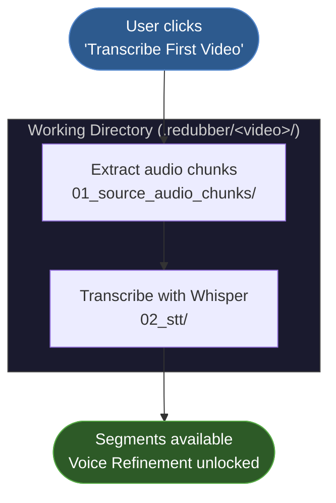
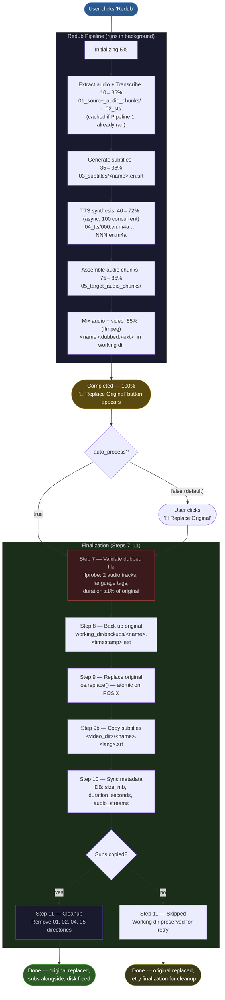

# Redubbing Pipeline

Redubber runs two distinct pipelines. The **Transcription Pipeline** is a lightweight prerequisite used before voice customisation — it only extracts audio and runs Whisper, incurring no TTS cost. The **Redub Pipeline** performs the full end-to-end job: transcription (reused if already done), subtitle generation, TTS synthesis, audio assembly, mixing, and finalization.

---

## Working Directory Layout

All artefacts are written inside the project's working directory (`.redubber/` by default, or the path configured in Settings → Working Directory). Each video gets its own subdirectory:

```
<working_dir>/
└── <video_filename>/              # e.g. "16. Structure of the Chest Area.mp4/"
    ├── 01_source_audio_chunks/    # M4A chunks fed to Whisper
    ├── 02_stt/                    # Transcription output (.seg, .txt, .transcript.json)
    ├── 03_subtitles/              # SRT subtitle file
    ├── 04_tts/                    # Per-segment TTS audio files (000.en.m4a … NNN.en.m4a)
    ├── 05_target_audio_chunks/    # Assembled dubbed audio chunks
    └── <name>.dubbed.<ext>        # Mixed output video (before finalization)
tts_previews/                      # Voice-refinement preview cache (project-level)
backups/                           # Original video backups (created at finalization)
```

---

## Pipeline 1 — Transcription Only

Triggered by **"Transcribe First Video"** in Voice Refinement when no segments exist yet.  
Purpose: obtain real transcription segments cheaply so voice customisation can happen before any TTS spend.

| Stage name | What it does | Output | Progress |
|---|---|---|---|
| `Extracting audio` | Split video audio into chunks | `01_source_audio_chunks/*.m4a` | 5 % |
| `Transcribing` | Run Whisper on each chunk | `02_stt/*.seg`, `*.txt`, `*.transcript.json` | 20 % |
| `Done — N segments` | Complete | Segments available in UI | 100 % |

After this pipeline completes, Voice Refinement can load real segments, play audio clips, generate voice instructions from the actual speaker's voice, and preview TTS samples for each voice.

---

## Pipeline 2 — Full Redub

Triggered by **"Redub"** on a video file.  
Steps 1–2 are skipped if the transcription pipeline already ran (`.seg` files present on disk).

| Stage name | What it does | Output | Progress |
|---|---|---|---|
| `Initializing` | Set up working directories | — | 5 % |
| `Extracting and transcribing audio` | Extract audio chunks + Whisper transcription | `01_source_audio_chunks/`, `02_stt/` | 10–35 % |
| `Generating subtitles` | Build SRT from transcription | `03_subtitles/<name>.en.srt` | 35–38 % |
| `Generating TTS (async)` | Synthesise one M4A per segment (up to 100 concurrent) | `04_tts/000.en.m4a … NNN.en.m4a` | 40–72 % |
| `Assembling audio (N/M)` | Concatenate TTS segments into dubbed audio | `05_target_audio_chunks/` | 75–85 % |
| `Mixing audio with video` | ffmpeg mix dubbed audio into original video | `<name>.dubbed.<ext>` in working dir | 85 % |
| `Completed` | Task done | Dubbed file ready | 100 % |

At 100 % the **"🔁 Replace Original"** button appears (or finalization runs automatically if `auto_process = true` in Settings).

### Finalization (Steps 7–11)

Triggered manually via "🔁 Replace Original", or automatically when `auto_process = true`.  
Runs **after** the task reaches 100 % — it is not part of the task progress counter.

| Step | Action | Notes |
|---|---|---|
| 7 | Validate dubbed file | ffprobe checks: video stream, 2 audio tracks with language metadata, duration within 1 % of original |
| 8 | Back up original | Copied to `<working_dir>/backups/<name>.<timestamp>.<ext>` |
| 9 | Replace original | `os.replace()` atomically moves dubbed file over the original path |
| 9b | Copy subtitles | `03_subtitles/<name>.en.srt` → `<video_dir>/<name>.<lang>.srt` (e.g. `video.jpn.srt`) |
| 10 | Sync metadata | Updates `size_mb`, `duration_seconds`, `audio_streams` in the database |
| 11 | Cleanup | Removes `01_source_audio_chunks`, `02_stt`, `04_tts`, `05_target_audio_chunks` to free disk. **Skipped if subtitle copy failed.** |

---

## Diagrams

### Pipeline 1 — Transcription Only



### Pipeline 2 — Full Redub + Finalization


